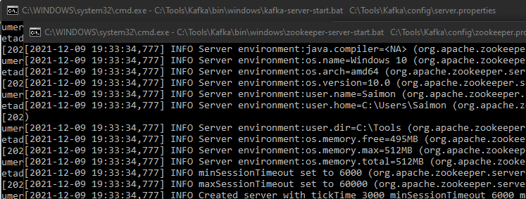
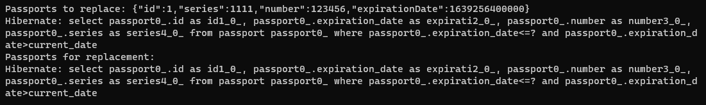
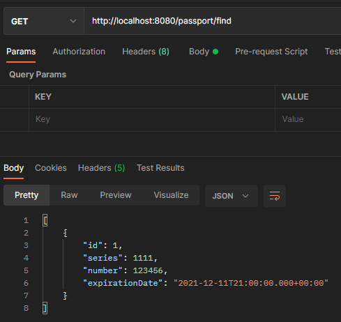
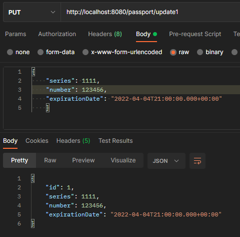
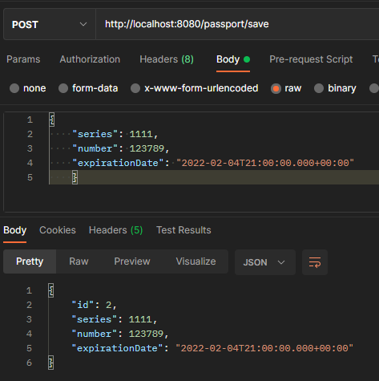
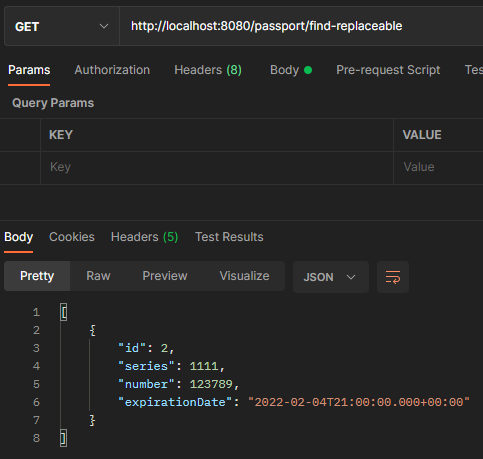

# Проект - Passport

## О проекте
- Данный проект - Spring boot приложение c REST архитектурой, представляет собой сервис управления паспортами.
- Поддерживаются следующие методы:
  - /save, сохранить данные паспорта;
  - /update{id}, обновить данные паспорта;
  - /delete{id}, удалить данные паспорта;
  - /find, загрузить все паспорта;
  - /find{series}, загрузить паспорта с заданной серией;
  - /unavailable, загрузить паспорта чей срок вышел;
  - /find-replaceable, загрузить паспорта, которые нужно заменить в ближайшие 3 месяца.
- Методы сервиса может вызывать другой сервис, используя RestTemplate.
- Реализована имитация сервиса рассылки почты. Он выводит ссобщения в консоль.  
- Есть возможность периодичной проверки просроченных паспортов. При нахождении таковых отправляется
запрос к сервису рассылки почты, который отправляет сообщения о том, что паспорт просрочен и его нужно заменить.
- Для взаимодействия использована Kafka.  
- Проект собран через docker-compose.  
- В качестве БД используется PostgreSQL.  
- Для проверки приложения используется Postman.  

## Сборка

Для сборки проекта необходимо:
1. Установить JDK 14.
2. Установить Maven.
3. Установить Postman.
4. Установить сервер БД PostgreSQL, задать логин - *postgres*, пароль - *password*.
5. Скачать исходный код проекта.
6. Создать в pg_Admin БД *passport*.
7. Открыть Query Tool для созданной БД и запустить SQL-скрипт `update_001.sql` из папки `db`.
8. Перейти в корень проекта, где лежит файл `pom.xml`.
9. Собрать проект командой `mvn -DskipTests=true package`.
   При успешной сборке должна появиться папка target c `passport-2.jar`.
10. Копируем `passport-2.jar` в *c:\Program Files\Java\jdk-14.0.1\bin\*
11. Для установки Kafka требуется предварительно установить Zookeeper, который позволяет координировать действия в системе.
    Необходимо скачать [архив](https://cloud.mail.ru/public/odoH/o5bPjcFu9), распаковать его в папку C:\Tools,
    прописать пути для Zookeeper в Path.

## Использование

Запускаем приложение `java -jar passport-2.jar` и Kafka `run-all.bat`.
  
В консоль выводится сообщение о паспорте, который скоро просрочится:  
  
Для проверки работы приложения будем использовать Postman, чтобы посылать соответствующие HTTP-запросы на REST-сервисы.
Получим список всех паспортов:  
  
Обновим дату срока годности:  
  
Добавим еще паспорт:  
  
Запросим информацию о паспортах, которые нужно заменить:  
  

## Контакты
